# Learning-Priors-for-Adversarial-Autoencoders

Experimental results for learning priors for adversarial autoencoders

## Content
- [Quantitative Analysis](#quantitative-analysis)
  - [Inception Scores Evaluation](#inception-scores-evaluation-on-cifar10)
- [Image Generation](#image-generation)
- [Learning Disentangled Representations (Supervised)](#learning-disentangled-representations-supervised)
- [Learning Disentangled Representations (Unsupervised)](#learning-disentangled-representations-unsupervised)

## Quantitative Analysis
### Inception Scores Evaluation on CIFAR10
|   | Proposed | Baseline |
| ------------- | ------------- | ------------- |
| Image generation  | 7.31  | 6.37 |
| Supervised  | 6.52 | 6.2 |
| Unsupervised  | 6.02  | 5.73 |

## Image Generation

### MNIST
| Proposed | Baseline |
| ------------- | ------------- |
|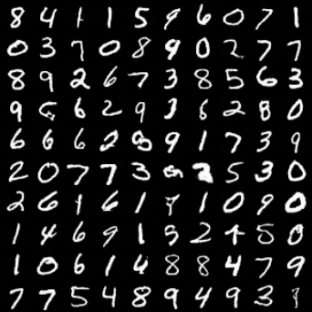| 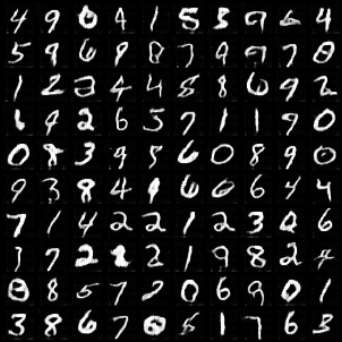 |

### CIFAR-10
| Proposed | Baseline |
| ------------- | ------------- |
|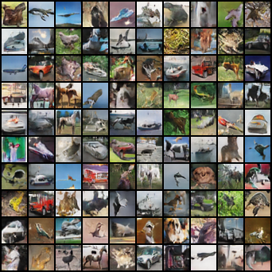| 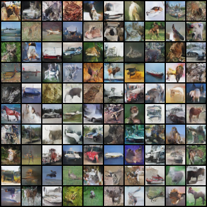 |

## Learning Disentangled Representations (Supervised)

### MNIST
| Proposed | Baseline |
| ------------- | ------------- |
|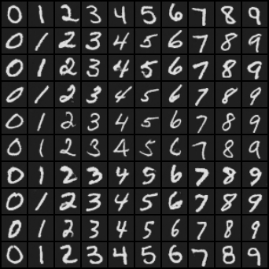| 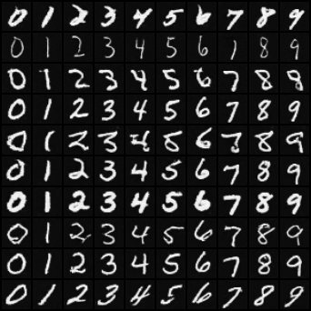 |

### SVHN
| Proposed | Baseline |
| ------------- | ------------- |
|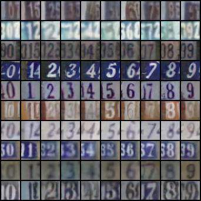| 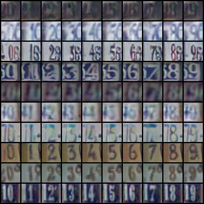 |

### CIFAR-10
| Proposed | Baseline |
| ------------- | ------------- |
|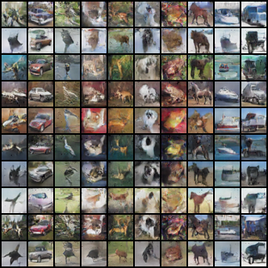| 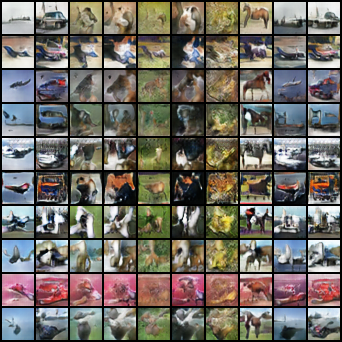 |

## Learning Disentangled Representations (Unsupervised)

### MNIST
| Proposed | Baseline |
| ------------- | ------------- |
|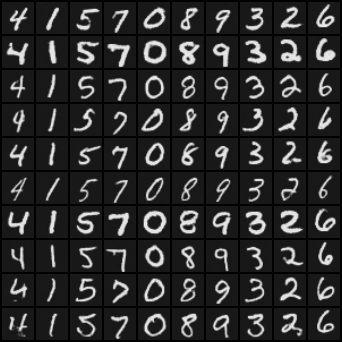| 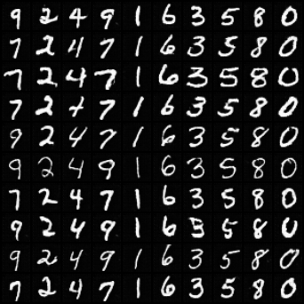 |

### SVHN
| Proposed | Baseline |
| ------------- | ------------- |
|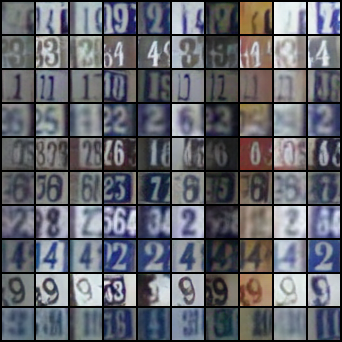| 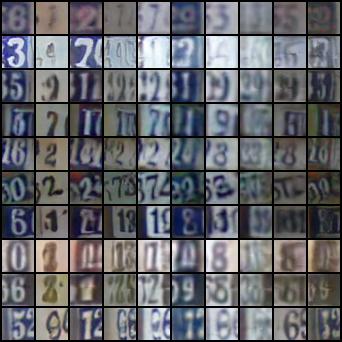 |

### CIFAR-10
| Proposed | Baseline |
| ------------- | ------------- |
|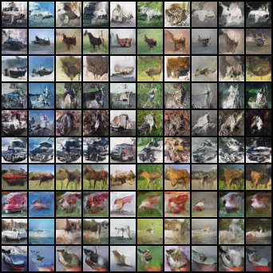| 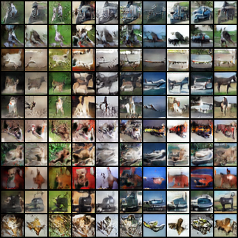 |
